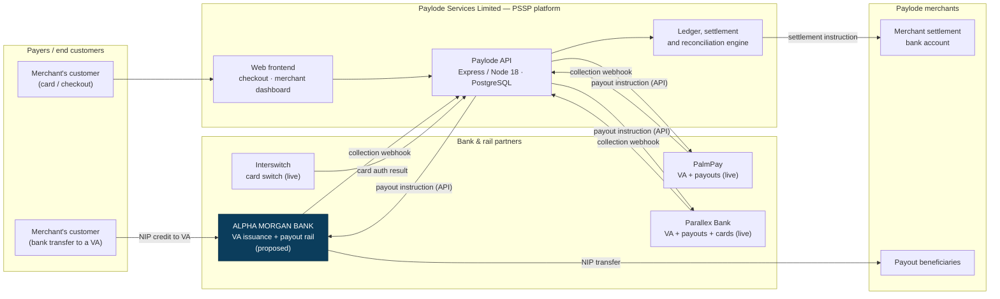
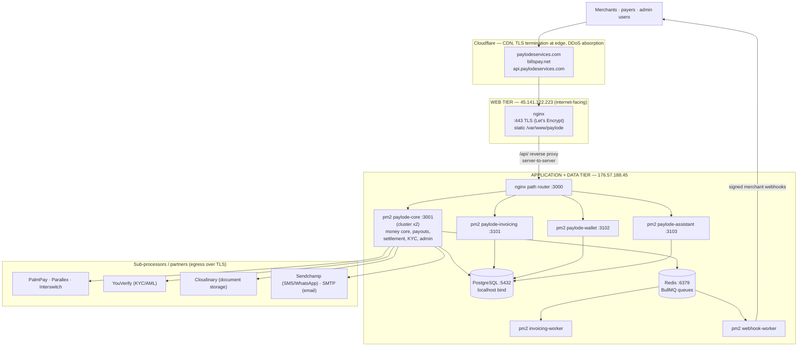
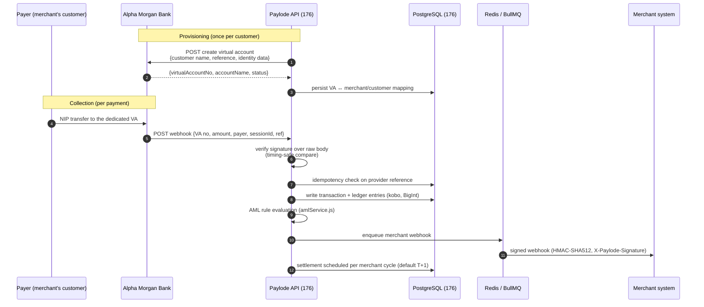
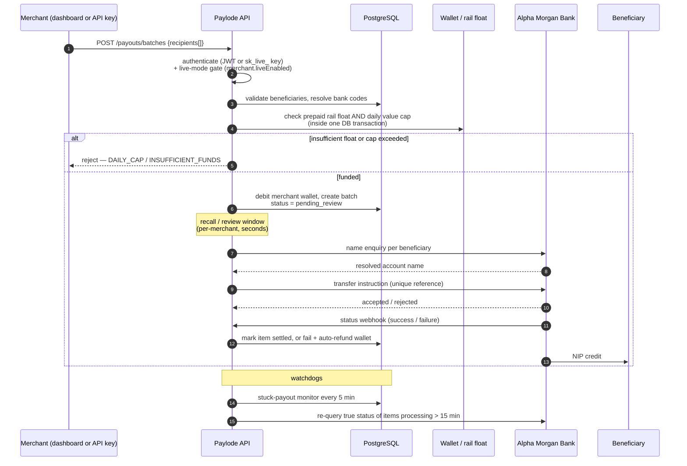
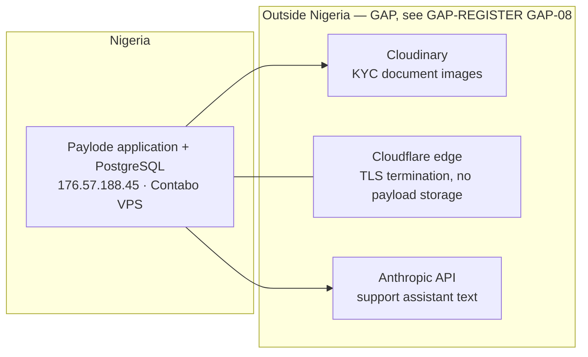

# ANNEX A — Architecture and Data Flow Diagram
### Paylode Services Limited · Alpha Morgan Bank AMB-ISO-VRQ-019 · CONFIDENTIAL

**Answers:** Section B ("Attach an Architecture / Data Flow Diagram"), item 13.9
("Is a current Data Flow Diagram available showing all Bank data exchanges?")

**Status:** [VERIFIED] — derived from the production codebase.
**Source of truth:** `backend/src/appFactory.js`, `backend/src/modules/`,
`docs/DEPLOYMENT.md`, `nginx/`, `.github/workflows/deploy.yml`.

---

## A.1 System context

Paylode is a CBN-licensed Payment Solution Service Provider operating a payment
gateway, virtual-account collections, invoicing, payouts and a closed-loop member
wallet. Alpha Morgan Bank is proposed as a **provider of two services to Paylode**:
virtual accounts for collections, and a payout rail for disbursements.

**Bank data exchanged with Alpha Morgan Bank — two directions only:**

| Direction | Channel | Payload |
|---|---|---|
| Paylode → Bank | HTTPS REST, outbound from a fixed IP | VA creation request (customer name, reference, identity type/number where the Bank requires it); payout instruction (beneficiary bank code, account number, account name, amount, narration, unique reference); name-enquiry request; balance / statement query |
| Bank → Paylode | HTTPS webhook to a published Paylode endpoint, signature-verified | Collection notification (VA number credited, amount, payer name/bank, session ID, timestamp); payout status callback (reference, status, session ID, failure reason) |

No direct database connection, no file transfer, and no SFTP drop is requested or
required. The integration type answered in Section A is **API only**.

---

## A.2 Deployment architecture (as built)

**Key properties (verified):**

- Two-tier split: the internet-facing box (45) serves **static assets only** and
  reverse-proxies `/api/` to the application box (176). No application code and
  no database runs on 45.
- PostgreSQL and Redis on 176 are **not published to the internet** — they are
  reached over loopback by the Node processes on the same host.
- A single nginx router on 176 listens on `:3000` and path-routes to four pm2
  services, so the public URL surface is identical whether the platform runs as
  the monolith or as split services (`nginx/paylode-176-router.conf`).
- Every process shares one middleware stack built by `backend/src/appFactory.js` —
  helmet, CORS allow-list, rate limiting and the error handler cannot drift
  between services.

---

## A.3 Bank data flow — Virtual Account collections (proposed Alpha Morgan flow)

**Controls on this path (verified):**

| Control | Implementation |
|---|---|
| Webhook authenticity | Raw body preserved for `/api/v1/webhooks/inbound` before JSON parsing (`appFactory.js`) so the signature is verified over exact bytes; comparison uses `crypto.timingSafeEqual` (`utils/helpers.js`). |
| Replay / duplicate credit | Provider reference is the idempotency key; a repeated notification does not create a second ledger entry. |
| Monetary precision | All amounts held in **kobo as integers** (`BigInt`), never floating point. |
| Money-laundering surveillance | `services/amlService.js` evaluates every transaction against tier limits, velocity and structuring rules, and raises rows in `aml_flags` for compliance disposition. |
| Merchant notification | Delivered asynchronously through Redis/BullMQ by a dedicated `webhook-worker` process, with retry — a slow merchant endpoint cannot block the Bank-facing path. |

---

## A.4 Bank data flow — Payouts / disbursements (proposed Alpha Morgan flow)

**Controls on this path (verified):** see `ANNEX-F` for the full Domain 16
response. In summary: payouts are **prepaid** (a merchant can only disburse funds
already funded into a per-rail wallet), guarded by a per-rail **daily value cap**
and **TPS limit**, held in a **recall window** before dispatch, **name-enquiry
validated** before transfer, and reconciled by two independent watchdogs that
auto-refund the merchant wallet on confirmed failure.

---

## A.5 Where Bank data comes to rest

The transactional record — VA mappings, transactions, ledger, settlements,
payouts, audit log — is held in a single PostgreSQL instance on the Nigerian
application host. **KYC document images are stored with Cloudinary and the
in-product assistant sends support text to the Anthropic API; both are outside
Nigeria.** This is disclosed honestly at items 7.2 and 13.4 and is tracked as a
remediation item, not claimed as compliant. See `ANNEX-G` and `GAP-REGISTER.md`.

---

## A.6 Trust boundaries

| # | Boundary | Crossing control |
|---|---|---|
| 1 | Internet → Cloudflare edge | TLS 1.2+; Cloudflare DDoS absorption and CDN |
| 2 | Cloudflare → nginx on 45 | HTTPS, Let's Encrypt certificate, HSTS `max-age=31536000; includeSubDomains` |
| 3 | nginx on 45 → nginx on 176 | Server-to-server proxy; **[GAP]** currently traverses the provider network in the clear between the two hosts — see GAP-02 (private networking / WireGuard) |
| 4 | nginx router → pm2 services | Loopback only |
| 5 | Application → PostgreSQL / Redis | Loopback only, not internet-exposed |
| 6 | Application → Bank / rails / sub-processors | Outbound HTTPS from a fixed IP; per-provider credentials in environment configuration |
| 7 | Application → merchant endpoints | Outbound signed webhooks (HMAC-SHA512) |
