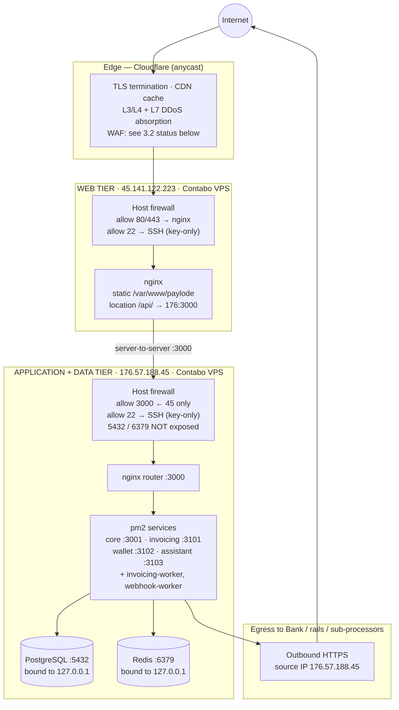
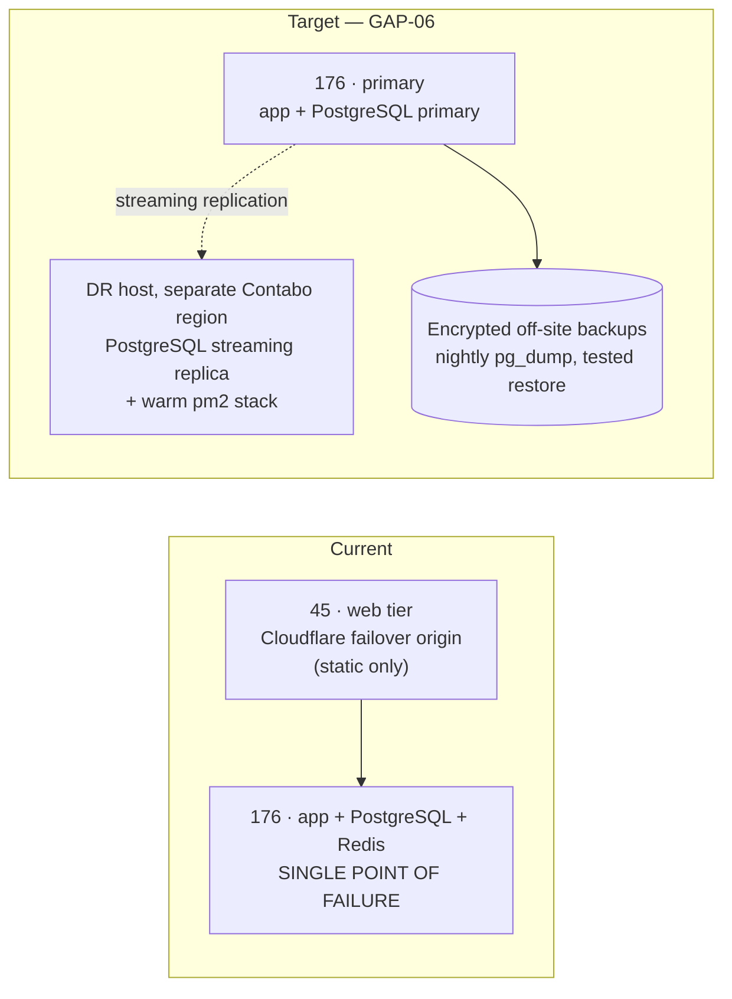

# ANNEX B — Network Architecture and Segmentation
### Paylode Services Limited · Alpha Morgan Bank AMB-ISO-VRQ-019 · CONFIDENTIAL

**Answers:** Domain 3 (3.1–3.9), item 3.6 (fixed IP range for Bank whitelisting),
item 12.3 (primary/DR site topology)

**Status:** mixed. Topology and TLS are [VERIFIED]; several Domain 3 controls are
[GAP] and are answered honestly below rather than claimed.

---

## B.1 Network topology

---

## B.2 Item 3.6 — Fixed IP addresses for Alpha Morgan Bank whitelisting

Paylode operates on **static, dedicated IPv4 addresses** (Contabo VPS, not
autoscaled, not behind a shared NAT pool). The following addresses are confirmed
in writing for the Bank's ingress and egress allow-lists:

| Address | Role | Direction relative to the Bank | Whitelist on |
|---|---|---|---|
| `176.57.188.45/32` | Paylode application host — the **only** source of outbound API calls to Alpha Morgan Bank (VA creation, name enquiry, payout instruction, balance/statement query) | Paylode → Bank | Bank API ingress allow-list |
| `45.141.122.223/32` | Paylode public web tier | Not used for Bank traffic | Not required, listed for completeness |

**Inbound to Paylode:** Bank webhook callbacks are delivered to
`https://api.paylodeservices.com/api/v1/webhooks/inbound/...` over TLS. Paylode
will additionally restrict that endpoint to the Bank's published source IP range
once the Bank supplies it — please provide it in the integration pack.

**Change control:** Paylode will give Alpha Morgan Bank **not less than 10
business days' written notice** before any change to the source IP above, so the
Bank can re-provision its allow-list. Any emergency change (host failure, DR
invocation) will be notified immediately by the incident contact in `ANNEX-H`.

---

## B.3 Domain 3 responses — honest status

| # | Question | Answer | Basis |
|---|---|---|---|
| 3.1 | Prod / staging / dev fully segregated at network level | **Partial** | **Logical segregation is enforced in the application and is strong**: every API key carries an `isSandbox` flag; sandbox keys (`sk_test_`) and live keys (`sk_live_`) are distinct credentials, every transaction row carries `is_sandbox`, and live money movement additionally requires `merchant.liveEnabled` set by an administrator. **Network-level** separation is not yet in place — sandbox and live workloads share the 176 host. Remediation: GAP-01. |
| 3.2 | WAF in front of all internet-facing applications and APIs | **Partial** | All public hostnames (`paylodeservices.com`, `billspay.net`, `api.paylodeservices.com`) are proxied through Cloudflare, which provides the edge WAF, bot control and TLS. Confirm and evidence the Cloudflare plan tier and that the managed WAF ruleset is enabled in *Block* (not *Log*) mode before answering "Yes" — see GAP-03. Application-layer defences that **are** verified: `helmet` security headers with CSP and HSTS, a CORS origin allow-list, `express-validator` input validation, and layered rate limiting (B.5). |
| 3.3 | IDS / IPS deployed and actively tuned | **No** | No host or network IDS/IPS is deployed. Remediation: GAP-04 (deploy CrowdSec or Wazuh on both hosts). |
| 3.4 | Anti-DDoS with documented provider and SLA | **Partial** | Cloudflare provides L3/L4/L7 DDoS mitigation for all Paylode domains. Attach the Cloudflare plan/subscription record as the "documented service provider"; note that unmetered DDoS mitigation is included on all Cloudflare plans but the **SLA** the Bank asks for applies only to Business/Enterprise tiers. State the actual tier. |
| 3.5 | Bank connectivity over dedicated leased line or encrypted VPN — no direct internet-facing settlement links | **Partial** | Today the Bank integration is over **TLS 1.2+ HTTPS on the public internet, restricted to a fixed source IP with mutual authentication credentials** — this is the standard Nigerian PSSP↔bank API pattern. Paylode will terminate an **IPSec or WireGuard tunnel to the Bank at no cost to the Bank if the Bank requires it**; this is a configuration change on the 176 host, not an architectural one. Offer this explicitly in the response — it turns a "Partial" into a commitment the Bank can accept. |
| 3.6 | Dedicated fixed IP range for whitelisting | **Yes** | Section B.2 above — `176.57.188.45/32`. |
| 3.7 | DNS security (DNSSEC, DNS filtering) | **Partial** | DNS is hosted at Cloudflare. DNSSEC can be enabled from the Cloudflare dashboard in one action — do it before responding, then answer "Yes" and attach the screenshot. Outbound DNS filtering on the hosts is not deployed (GAP-04). |
| 3.8 | Secure email gateway with anti-phishing / anti-malware | **Partial** | Corporate mail is on Google Workspace, which provides the gateway, anti-phishing and attachment scanning. Evidence: attach the Workspace security settings and confirm SPF, DKIM and DMARC records are published for `paylodeservices.com` (verify DMARC is at `p=quarantine` or `p=reject`, not `p=none`). |
| 3.9 | Firewall rules reviewed at least annually with approval trail | **Partial** | Host firewall rules (UFW/iptables on both VPS hosts) and Cloudflare rules exist but there is no documented review cycle. `policy/POL-01` §7 establishes a semi-annual review with a signed change log. First review to be performed and dated before submission. |

---

## B.4 Transport security (supports 9.2)

| Path | Protocol | Evidence |
|---|---|---|
| Browser → Cloudflare → nginx (45) | TLS 1.2 minimum, TLS 1.3 preferred; Let's Encrypt certificate managed by Certbot with automatic renewal; `ssl_dhparam` from the Certbot-managed parameters | `nginx/paylode.conf` |
| HSTS | `Strict-Transport-Security: max-age=31536000; includeSubDomains` set by `helmet` on every API response | `backend/src/appFactory.js` |
| Content Security Policy | `default-src 'self'`, `script-src 'self'`, `img-src 'self' data:` | `backend/src/appFactory.js` |
| Paylode → Bank / rails / KYC / storage | Outbound HTTPS (TLS 1.2+) enforced by the Node 18 TLS stack | `backend/src/modules/gateway-core/services/*Service.js` |
| Paylode → merchant webhooks | HTTPS with `X-Paylode-Signature` HMAC-SHA512 | `backend/src/utils/helpers.js`, `backend/src/workers/webhookWorker.js` |

**Verification the Bank can run itself:** an SSLLabs / testssl.sh scan against
`api.paylodeservices.com`. Run it yourself first and attach the report — if it
returns anything below A, fix the cipher suite before submitting.

---

## B.5 Rate limiting and abuse control (supports 3.2, 6.2)

All limits are enforced in `backend/src/appFactory.js` by `express-rate-limit`,
keyed per client IP (`trust proxy` is set to 1 so the Cloudflare-forwarded client
IP is used, not the proxy's).

| Scope | Window | Limit | Response |
|---|---|---|---|
| All `/api/*` | 15 minutes | 100 requests (env-tunable `RATE_LIMIT_MAX_REQUESTS`) | `429` + `RATE_LIMIT_EXCEEDED` |
| `/api/v1/auth/login` | 15 minutes | 10 attempts | `429` + `AUTH_RATE_LIMIT` |
| `/api/v1/onboarding/submit` | 1 hour | 10 submissions | `429` + `ONBOARDING_RATE_LIMIT` |
| Request body | per request | 2 MB default; 50 MB only on `/api/v1/onboarding/submit` (base64 document scans) | `413` |
| File upload | per file | 5 MB (`multer`) | rejected |

A **dedicated, higher limit will be agreed and configured for Alpha Morgan Bank's
callback source IP** so that a legitimate settlement-day burst of collection
webhooks is never throttled. Paylode proposes 600 requests/minute for the Bank
webhook path; the Bank should state its expected peak notification rate.

---

## B.6 Primary and DR topology (supports 12.3)

**Current state, stated plainly:** Paylode runs a **primary site only**. The two
hosts are separate VPS instances at Contabo; the web tier (45) is configured as a
Cloudflare failover origin for static content, which preserves the marketing and
login surface but **does not preserve the API or database**. There is no
warm standby for PostgreSQL today.

Answer 12.3 as **Partial** and attach this diagram plus the GAP-06 remediation
plan. Do not state an RTO/RPO the current architecture cannot meet — see
`ANNEX-I` for the numbers Paylode can actually commit to today versus after
remediation.
