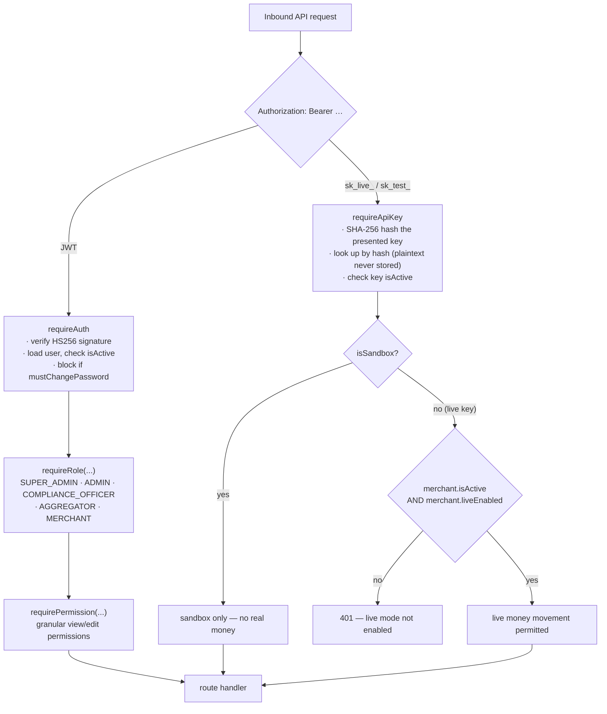

# ANNEX C — API Security Design and API Inventory
### Paylode Services Limited · Alpha Morgan Bank AMB-ISO-VRQ-019 · CONFIDENTIAL

**Answers:** Domain 6 (6.1–6.9), item 16.9 (status callbacks)
**Status:** [VERIFIED] against `backend/src/` unless marked otherwise.

---

## C.1 API authentication model

Paylode operates **two distinct credential types** with different trust levels.

**6.1 — OAuth 2.0 / OpenID Connect: answer "No — compensating controls".**
Paylode does not implement OAuth 2.0 for its merchant API. It uses **bearer API
keys and short-lived signed JWTs**, which is the prevailing model for Nigerian
PSSP merchant APIs. State this plainly and list the compensating controls:

- API keys are **never stored in plaintext**. Only `SHA-256(key)` is persisted
  and lookup is by hash (`utils/helpers.js: hashApiKey`, `middleware/auth.js`).
  A database compromise does not yield usable keys.
- Keys are generated from 24 bytes of `crypto.randomBytes` — 192 bits of entropy.
- Environment is bound into the credential itself (`sk_live_` vs `sk_test_`), so a
  test key cannot move real money by mistake.
- A live key is inert until an administrator explicitly enables live mode on the
  merchant (`merchant.liveEnabled`) — activation alone is not enough. This gate
  covers **both collections and payouts**.
- Every key records `lastUsedAt`, so dormant credentials are visible.
- Deactivation is immediate: `apiKey.isActive = false` blocks the next request.

**For the Alpha Morgan Bank integration specifically, Paylode will adopt whichever
scheme the Bank mandates** — OAuth 2.0 client-credentials, mTLS, or signed
request headers. Say so in the response; the Bank's own API contract normally
decides this, not the vendor's.

**6.3 — mTLS: answer "Partial / committed".** Not implemented today on the
merchant-facing API. Paylode **will terminate mutual TLS on the Bank-facing
integration** if the Bank issues client certificates — the outbound HTTPS client
in the rail adapters accepts a client certificate and key with a configuration
change only. Offer this as a commitment with a delivery date (GAP-07).

---

## C.2 Session and token policy (6.6)

| Control | Value | Source |
|---|---|---|
| Algorithm | HS256, secret from `JWT_SECRET` environment variable | `middleware/auth.js` |
| Claim used | `userId` only — no role or permission claim is trusted from the token; the role is re-read from the database on **every** request | `middleware/auth.js` |
| Revocation | Immediate — `user.isActive = false` fails the next request even with an unexpired token | `middleware/auth.js` |
| Forced password change | A user flagged `mustChangePassword` can reach only `/auth/me`, `/auth/change-password`, `/auth/logout`; every other route returns `403 PASSWORD_CHANGE_REQUIRED` | `middleware/auth.js` |
| Expiry | Set at issue in `routes/auth.js` (`JWT_EXPIRES_IN`) | **Action before submission:** confirm the configured value. If it exceeds 24 hours, reduce it to **8 hours for merchant users and 1 hour for administrative users** before answering 6.6 "Yes". |

Re-reading role and status from the database on each request is a genuinely
strong property and worth stating explicitly to the assessor: a stolen JWT cannot
outlive the account it belongs to, and it cannot carry escalated privileges.

---

## C.3 Second-factor and step-up authentication

| Control | Detail | Source |
|---|---|---|
| TOTP 2FA | RFC 6238, 6 digits, 30-second step, ±1 step validation window, provisioned by `otpauth://` QR | `routes/auth.js` |
| Login flow | When `totpEnabled`, password success returns a challenge, not a session; the session is issued only after the TOTP code verifies | `routes/auth.js` |
| Step-up re-authentication | Revealing or rotating a webhook signing secret requires the password **again** plus a fresh TOTP code — a hijacked session alone cannot lift a secret | `services/reauth.js`, `routes/webhooks.js` |
| Password storage | `bcryptjs` | `services/reauth.js`, `routes/auth.js` |

**[GAP] 2FA is available but not enforced.** Before answering 2.1 ("MFA enforced
on all privileged accounts … without exception") the platform must **require**
TOTP for every `SUPER_ADMIN`, `ADMIN` and `COMPLIANCE_OFFICER` account. This is a
small, high-value change and is the single fastest way to convert a HIGH-priority
"Partial" into a "Yes". Tracked as GAP-09.

---

## C.4 Webhook security — both directions

**Outbound (Paylode → merchant, and Paylode → Bank if the Bank consumes callbacks):**

- Signature: `HMAC-SHA512(rawPayload, merchantWebhookSecret)`, sent in the
  `X-Paylode-Signature` header (`utils/helpers.js: signWebhook`).
- Delivered asynchronously through Redis/BullMQ by a dedicated `webhook-worker`
  process with retry, so a failing consumer cannot back-pressure the money path.
- Every attempt is recorded in the `webhook_deliveries` table.
- The signing secret is per-merchant and rotatable; rotation requires step-up
  re-authentication (C.3).

**Inbound (Bank / rail → Paylode):**

- `express.raw()` is mounted on `/api/v1/webhooks/inbound` **before** the JSON
  body parser, so the signature is verified against the exact bytes received —
  this defeats the canonicalisation attacks that break naive re-serialisation
  (`appFactory.js`).
- Comparison uses `crypto.timingSafeEqual` (`utils/helpers.js: verifyWebhookSig`),
  not `===`, so the check is not vulnerable to timing analysis.
- Provider references are treated as idempotency keys — a replayed notification
  cannot double-credit a merchant.

---

## C.5 Back-off, retry and cascade protection (6.5)

The Bank asks how Paylode avoids cascading outages on its endpoints. Verified
mechanisms:

| Mechanism | Behaviour | Source |
|---|---|---|
| Per-rail health tracking | Every call result is recorded; consecutive failures mark the rail unhealthy and raise an incident notification | `modules/gateway-core/services/railHealth.js` |
| Automatic rail failover | A merchant's payouts route by split percentages or a per-merchant/global default; a rail not in `LIVE` status with `payout_enabled` is removed from routing rather than retried into the ground | `routes/payouts.js: resolveRouteRail` |
| TPS ceiling | Each rail carries a `tps_limit`; dispatch is chunked and concurrency-bounded so Paylode never exceeds the rate a partner has agreed | `payment_rails.tps_limit`, `routes/payouts.js` |
| Daily value cap | Each rail carries `daily_value_cap`; the remaining capacity is computed inside the dispatch transaction and the batch is rejected rather than partially sent | `routes/payouts.js: remainingDailyCap` |
| Bounded status re-query | Items in `processing` for more than 15 minutes are re-queried once per 5-minute watchdog cycle — a fixed, low, predictable poll rate, not exponential hammering | `cron/payoutWatchdog.js`, `cron/stuckPayoutCron.js` |
| Idempotent instructions | Every payout instruction carries a unique reference so a retry cannot double-pay | `routes/payouts.js`, `services/*Service.js` |

**Commitment to offer the Bank:** Paylode will honour the Bank's published rate
limits, back off on HTTP 429 and 5xx with exponential delay plus jitter, cap
retries per instruction, and treat any ambiguous response as *pending* — resolved
by status re-query, never by re-sending the transfer.

---

## C.6 API inventory (6.7)

Mounted under `/api/v1/`. A full machine-readable OpenAPI specification should be
generated and attached — see GAP-10.

| Group | Path prefix | Auth | Notes |
|---|---|---|---|
| Authentication | `/auth` | public → JWT | login, 2FA setup/verify, change-password, logout, `/me` |
| Merchants | `/merchants` | JWT | profile, activation, go-live, settlement account (change requires approval) |
| Transactions | `/transactions` | API key / JWT | collection records |
| Checkout | `/checkout` | public + API key | hosted payment page initialisation |
| Payouts | `/payouts` | JWT **or** `sk_live_`/`sk_test_` | batches, wallet, ledger, banks, admin routing |
| Settlements | `/settlements` | JWT | merchant settlement batches |
| Reconciliation | `/reconciliation` | JWT | bank-statement upload and auto-match |
| Rails | `/rails` | JWT (admin) | rail status, float, caps |
| KYC | `/kyc` | JWT | submission, review, verification reports |
| Compliance | `/compliance` | JWT (compliance) | AML flags, exceptions, watchlist |
| Onboarding | `/onboarding` | public (rate-limited) | merchant application intake |
| Webhooks (outbound config) | `/webhooks` | JWT + step-up | secret reveal/rotate, delivery log |
| Webhooks (inbound) | `/webhooks/inbound/*` | signature-verified | rail and provider callbacks |
| Invoicing | `/invoicing` | JWT | invoicing module (own tables) |
| Wallet | `/wallet` | JWT | closed-loop member wallet (own tables) |
| Assistant | `/assistant` | JWT | in-product support assistant |
| Admin | `/admin`, `/users`, `/platform-settings` | JWT + role | administrative surface |
| Health | `/health`, `/health/modules` | public | liveness and per-module status |

---

## C.7 Logging and retention of API activity (6.8)

- Every HTTP request is logged in Apache **combined** format through `morgan`,
  piped into the structured `pino` logger (`appFactory.js`).
- Every state-changing administrative and money-movement action writes an
  `audit_logs` row: actor, action, entity type, entity id, **before state**,
  **after state**, free-text note and source IP (`services/auditService.js`).
- Webhook delivery attempts are retained in `webhook_deliveries`.

**[GAP] The 12-month retention the Bank requires at 6.8 and 10.3 is not yet
guaranteed.** Database audit rows persist, but process logs are written to disk on
the host without a documented rotation, retention or immutability policy. See
GAP-11; do not answer 6.8 "Yes" until log shipping to write-once storage with a
12-month floor is in place.

---

## C.8 API penetration testing (6.9)

**[GAP] No independent API penetration test has been performed.** This is a HIGH
priority item and the Bank will weight it heavily. Answer "No" with a booked
engagement date. See GAP-12 — this is the single most valuable item to procure
before submission, because 6.9, 8.3, 8.4 and 11.5 all depend on it.
