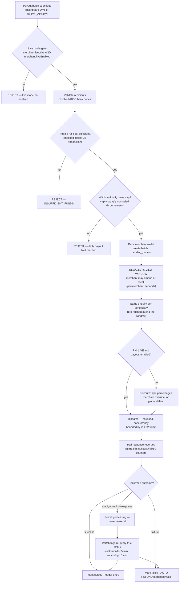

# ANNEX F — Virtual Account and Payout Service Controls
### Paylode Services Limited · Alpha Morgan Bank AMB-ISO-VRQ-019 · CONFIDENTIAL

**Answers:** Domain 16 in full (16.1–16.10)
**Status:** [VERIFIED] against `backend/src/modules/gateway-core/` unless marked.

This is the domain the Bank's credit and operations teams will read most closely,
because it governs the Bank's own money. It is also Paylode's strongest domain —
the controls below are implemented, not aspirational.

---

## F.1 Payout control flow

---

## F.2 Item-by-item response

### 16.1 — Dedicated, uniquely identifiable VA per customer, no reuse — **Yes**

Virtual accounts are provisioned one-per-customer through the rail's VA API and
persisted with a unique mapping row (`merchant_virtual_accounts`, keyed to
merchant and customer reference). Provisioning is administratively gated: a
PalmPay VA requires **approved CAC data from an APPROVED KYC submission** before
it will be created (`routes/payouts.js: POST /admin/provision-va/:merchantId`).
VA numbers are issued by the sponsoring institution and are never recycled across
customers by Paylode.

*Alpha Morgan numbering scheme:* to be agreed with the Bank. Paylode's requirement
is only that each VA is unique, permanently mapped to one customer of one
merchant, and carries a reference Paylode supplies at creation so that inbound
credits are attributable without ambiguity.

### 16.2 — Segregated collection account, ring-fenced from operating funds — **Yes**

Collected customer funds settle into a designated collection account and are
tracked in the platform ledger separately from Paylode's own operating funds.
The ledger models merchant balances (`merchant_wallets`, `wallet_ledger`) as
liabilities to merchants, distinct from Paylode revenue (fees and VAT computed
per transaction by `computeProductFee()` and settled separately).

**Action before submission:** attach the Bank mandate or account-opening
confirmation showing the collection account is designated as a **customer funds /
pooled collection account**, not a Paylode operating account. This is a
documentary item, not a code item, and the Bank will ask for it.

### 16.3 — Committed settlement cycle — **T+1 by default**

`merchants.settlement_cycle` defaults to `"t1"`. Settlement batches are generated
and fired by a scheduled job that runs continuously (`modules/gateway-core/jobs.js`
— settlement firing and reconciliation on a short interval, plus a daily
generation cycle anchored at **00:01 Africa/Lagos**, implemented as 23:01 UTC
with a self-correcting schedule so no DST or drift error occurs).

Paylode can support **T+0** for named merchants where the Bank's own liquidity
arrangement permits. State the cycle the Bank is being asked to support and any
cut-off time in the integration agreement.

### 16.4 — Maker-checker / dual authorisation on payout initiation — **Partial**

Answer honestly, then describe what exists, because the existing controls are
substantive:

**What is enforced today:**
- **Prepaid model.** A merchant can only disburse funds already funded into a
  per-rail wallet. There is no credit line, no overdraft, and the float check runs
  **inside the same database transaction** as the debit, so a race cannot
  overdraw the wallet.
- **Recall / review window.** A batch is created in `pending_review` and dispatch
  is deferred by a per-merchant window (`merchants.payout_recall_window_seconds`).
  During the window the merchant can amend or recall the batch; name enquiry runs
  in the background so the delay costs no latency at dispatch.
- **Segregation on the Paylode side.** Wallet funding, rail rebalancing and
  routing changes require `SUPER_ADMIN`; merchants cannot fund their own wallet
  or alter caps. Settlement-account changes are held in `pending_settlement_*`
  columns until an administrator approves them — a merchant cannot redirect their
  own settlement destination unilaterally.
- **Full audit.** Every administrative action writes an `audit_logs` row with
  actor, before state, after state and source IP.

**[GAP]** A formal *two-named-humans* maker-checker on merchant-initiated payout
batches is **not** enforced — a single merchant operator with a live API key can
submit a batch that dispatches after the recall window. Tracked as **GAP-19**;
this is the highest-value control to add for this engagement. Recommended
implementation: a per-merchant threshold above which a batch requires approval by
a second user holding an approver role, with the approval recorded in
`audit_logs`. Offer the Bank a delivery date.

### 16.5 — Per-transaction and daily aggregate payout limits — **Yes**

Enforced at three layers:

| Layer | Control | Implementation |
|---|---|---|
| Rail | `payment_rails.daily_value_cap` — remaining capacity computed as `cap − SUM(today's disbursements not failed/reversed)` inside the dispatch transaction | `routes/payouts.js: remainingDailyCap()` |
| Rail | `payment_rails.tps_limit` — dispatch concurrency bounded per rail | `routes/payouts.js`, `payment_rails` |
| Merchant | Prepaid wallet balance is an absolute ceiling — a merchant cannot pay out more than they funded | `merchant_wallets`, guarded debit |
| Merchant / KYC tier | Single-transaction ceilings by tier: **Tier 1 ₦5,000,000 · Tier 2 ₦100,000,000 · Tier 3 ₦500,000,000**; a transaction above 80% of the tier ceiling raises a HIGH AML flag | `services/amlService.js` |

Rail caps are administratively adjustable (`PUT /payouts/admin/payout-rails/:id`,
`SUPER_ADMIN` only, audited). **Paylode will configure the Bank-agreed
per-transaction and daily aggregate ceilings on the Alpha Morgan rail before go-live
and will not raise them without the Bank's written agreement.** Offer that as a
contractual commitment — it is cheap for Paylode and materially reassuring to the
Bank.

### 16.6 — Beneficiary screening before payout execution — **Partial**

**What exists:** an AML rule engine evaluates transactions and raises
dispositionable flags (`services/amlService.js` → `aml_flags`): single
transaction above 80% of the tier ceiling (**HIGH**), more than 20 transactions in
2 hours (**CRITICAL**), and a structuring/round-amount pattern (**MEDIUM**). A
compliance watchlist table (`compliance_watchlist`) and a compliance exception
workflow (`compliance_exceptions` — defer, clear, block, with an hourly sweep that
re-opens expired deferrals) are implemented, and the compliance role has a
dedicated review surface. Every beneficiary is **name-enquiry validated** with the
rail before transfer, so funds are not sent to an unresolvable account.

**[GAP]** Real-time **sanctions and PEP screening against a licensed list**
(OFAC / UN / EU / NGSL) is **not** wired into the payout path — `config/serviceProviders.js`
records the sanctions/PEP provider as a *placeholder list in use*. For a bank
counterparty this is a material gap, tracked as **GAP-20**, and it should be closed
before go-live rather than merely disclosed. Options: Dojah or Youverify screening
endpoints, or a dedicated AML screening vendor. Answer 16.6 "Partial" and attach
the procurement plan and target date.

### 16.7 — Daily reconciliation against Bank VA and payout records — **Yes**

| Layer | Mechanism |
|---|---|
| Continuous payout reconciliation | Runs on a short interval in `modules/gateway-core/jobs.js`; re-queries the rail for the true status of sent items |
| Stuck-payout monitor | Every **5 minutes** — finds batches in `processing` whose legs were never sent and recovers or alerts (`cron/stuckPayoutCron.js`) |
| Payout watchdog | Every **5 minutes** — items in `processing` for over **15 minutes** are re-queried at the rail and auto-resolved to success, or failed **with an automatic refund to the merchant wallet** (`cron/payoutWatchdog.js`) |
| Rail float sync | Periodic poll of each rail's balance against the platform's expected float (`services/railFloat.js`) |
| Bank statement reconciliation | An engine matches uploaded bank-statement **credit lines** against settlements 1:1, on amount within a configurable tolerance (default ₦1) **and** a date window covering the expected T+1/T+2 landing lag, classifying each as `matched`, `partial` or `unmatched` (`services/reconcile.js`) |
| Settlement reconciliation | Fired settlements are reconciled on the settlement job cycle |

**Discrepancy-resolution SLA to commit to the Bank:** any unmatched item is
raised within **1 business day** of the reconciliation run; investigation
commences immediately; resolution or a written status is provided to the Bank
within **3 business days**. Value-affecting discrepancies are escalated to the
incident contact in `ANNEX-H` on discovery, not on the SLA clock.

### 16.8 — Failed, reversed or delayed payouts — **Yes**

- A confirmed failure marks the item `failed` with a stored `failure_reason` and
  triggers an **automatic refund** to the merchant wallet (`refund_status='approved'`,
  reviewer recorded as `auto`, timestamped) — the merchant is made whole without
  a support ticket.
- An **ambiguous** response is never re-sent. The item stays `processing` and is
  resolved by status re-query. This is the single most important control against
  double-payment and it is implemented deliberately.
- Batch-level retry of failed items only is available (`POST /payouts/batches/:id/retry-failed`).
- Batch reports are downloadable as PDF and CSV for merchant and Bank
  reconciliation.
- Fund-return timeline to commit: refund to the merchant wallet on confirmed
  failure is **immediate and automatic**; onward return to the merchant's
  settlement account follows the normal settlement cycle.

### 16.9 — Real-time status updates to the Bank — **Yes**

Paylode operates a signed webhook infrastructure in both directions
(`ANNEX-C` §C.4): HMAC-SHA512 signatures, raw-body verification, asynchronous
delivery through Redis/BullMQ with retry, and a `webhook_deliveries` audit table.
Paylode will publish a **Bank-facing status callback** for collections and payouts
on whatever schema the Bank specifies, or consume the Bank's callbacks —
whichever the Bank's integration pack defines. Polling endpoints
(`GET /payouts/items/:id/status`, `GET /payouts/batches/:id`) are available as a
fallback.

### 16.10 — Maximum single transaction value and expected volumes — **to be completed by Paylode**

The repository cannot answer this; it is a commercial projection. Provide:

| Field | Value |
|---|---|
| Maximum single collection value | ₦______ |
| Maximum single payout value | ₦______ |
| Expected daily collection volume / value | ______ txns / ₦______ |
| Expected daily payout volume / value | ______ txns / ₦______ |
| Expected monthly value through the Bank | ₦______ |
| Peak-day multiple (month-end, salary runs) | ______× average |

Base these on actual platform history rather than ambition — the Bank will size
its own limits, float and monitoring from these numbers, and an inflated
projection invites limits Paylode cannot fill while an understated one causes
declines on the first busy day.

---

## F.3 Summary for the assessor

| Control the Bank asked for | Status |
|---|---|
| Unique VA per customer, no reuse | Implemented |
| Segregated collection account | Implemented — attach the Bank mandate |
| Committed settlement cycle | T+1 default, T+0 available |
| Prepaid payouts, no credit exposure to the Bank | Implemented |
| Per-rail daily value cap and TPS limit | Implemented |
| Tiered transaction ceilings with AML flagging | Implemented |
| Name enquiry before every transfer | Implemented |
| Recall / review window before dispatch | Implemented |
| Automatic refund on confirmed failure | Implemented |
| No re-send on ambiguous response | Implemented |
| Two independent payout watchdogs | Implemented |
| Bank-statement reconciliation engine | Implemented |
| Full audit trail with before/after state | Implemented |
| **Two-person maker-checker on merchant payouts** | **Gap — GAP-19** |
| **Live sanctions / PEP screening in the payout path** | **Gap — GAP-20** |
