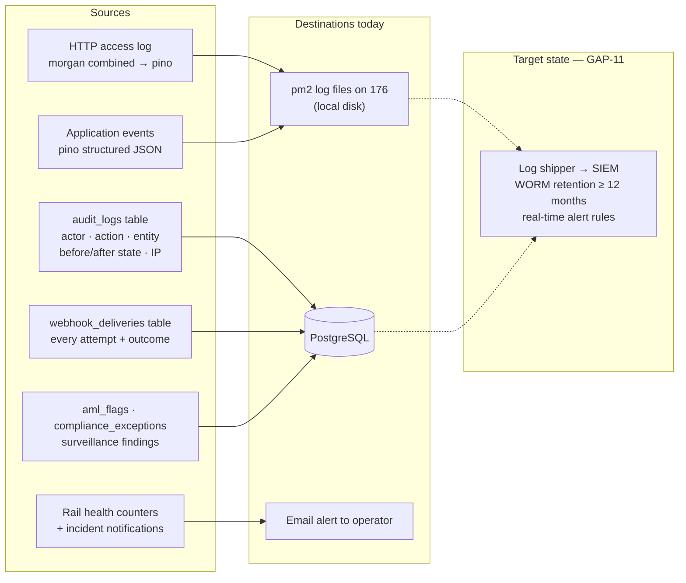

# ANNEX H — Logging, Monitoring and Incident Response
### Paylode Services Limited · Alpha Morgan Bank AMB-ISO-VRQ-019 · CONFIDENTIAL

**Answers:** Domain 10 (10.1–10.7), Domain 11 (11.1–11.6), item 6.8
**Status:** mixed — application-layer telemetry is [VERIFIED]; security operations
tooling is largely [GAP] and is answered as such.

---

## H.1 What is logged today (verified)

### The audit log — Paylode's strongest monitoring asset

`services/auditService.js` writes an `audit_logs` row for every state-changing
administrative and money-movement action, capturing:

| Field | Content |
|---|---|
| `actorId` | The authenticated user who performed the action |
| `action` | e.g. `MERCHANT_GO_LIVE`, `MERCHANT_SET_SANDBOX`, wallet funding, rail configuration change, KYC disposition |
| `entityType` / `entityId` | What was changed |
| `beforeState` / `afterState` | **Full JSON snapshots either side of the change** |
| `notes` | Reviewer rationale |
| `ipAddress` | Source IP of the actor |

Before/after state capture is unusual in a platform of this size and is worth
drawing to the assessor's attention: it means any disputed configuration change —
a raised cap, a flipped live flag, an altered settlement account — can be
reconstructed exactly, with the actor and their IP.

Automated operational alerting that exists today: rail incident notifications on
consecutive failures, rail low-balance alerts, and a stuck-payout email summary
issued only when the watchdog actually fixes something.

---

## H.2 Domain 10 — honest responses

| # | Question | Answer | Detail |
|---|---|---|---|
| 10.1 | 24/7 in-house or managed SOC | **No** | Paylode does not operate a SOC and has not retained a managed SOC provider. Automated alerting exists (rail incidents, stuck payouts, low float) and reaches the operations team by email, but there is no 24/7 staffed monitoring. GAP-23. |
| 10.2 | SIEM with centralised aggregation and real-time alerting | **No** | Logs are structured (`pino`) and therefore ship cleanly to a SIEM, but none is deployed. Recommended: Wazuh self-hosted (no licence cost) or Better Stack / Grafana Loki. GAP-11. |
| 10.3 | Immutable / WORM logs, ≥12-month retention | **Partial** | `audit_logs` and `webhook_deliveries` persist in PostgreSQL for the life of the record and are append-only in application practice, but they are **not cryptographically tamper-evident** and a database administrator could alter them. Process logs on disk have no documented rotation or retention floor. GAP-11. |
| 10.4 | Threat intelligence feeds | **No** | Not subscribed. Low-cost remediation: CERT-NG advisories, the CBN CISO forum circulars, NIBSS security bulletins, GitHub Advisory Database, and the free CIRCL / abuse.ch feeds once a SIEM exists. GAP-23. |
| 10.5 | Documented MTTD / MTTR targets | **Partial** | Targets are defined in `policy/POL-04` §5 and reproduced in H.4 below, but they are **newly set and not yet evidenced by measured performance**. Say that. A target with no measurement history is a commitment, not evidence. |
| 10.6 | Log extracts to the Bank within 4 business hours | **Yes** | Transaction, payout, settlement, webhook-delivery and audit records are queryable from PostgreSQL and exportable to CSV/PDF; batch reports already export in both formats. Paylode commits contractually to **4 business hours** for a scoped log extract request from the Bank, and to **1 business hour** where the request relates to a live incident. |
| 10.7 | Security event monitoring description | **Partial** | Described in H.1. The application-layer and money-movement monitoring is genuine and continuous; the infrastructure-layer monitoring (IDS/IPS, EDR, SIEM correlation) does not exist. Do not blur the two. |

---

## H.3 Domain 11 — Incident response

| # | Question | Answer | Detail |
|---|---|---|---|
| 11.1 | Board-approved IR plan with playbooks | **Partial** | `policy/POL-04-incident-response-plan.md` is drafted with playbooks for ransomware, data breach, insider threat, payment-rail compromise and credential exposure. It requires director approval and signature before it can be cited as evidence. |
| 11.2 | Named 24/7-reachable incident contact | **Yes, once populated** — complete H.5 below and share it with the Bank. |
| 11.3 | Breach-notification SLA | **Yes — commit to 24 hours** | See H.4. |
| 11.4 | Tabletop / live IR exercise in the last 12 months | **No** | None conducted. GAP-24. A tabletop costs nothing but a half-day: run one against the POL-04 credential-exposure playbook (which the GAP-05 finding makes realistic), write the after-action report, and this HIGH item becomes "Yes" before submission. **Do this.** |
| 11.5 | External penetration test frequency | **No test performed** | Commit to **annual** full-scope VAPT plus a test after any significant architectural change, per POL-01 §8. GAP-12. |
| 11.6 | Post-incident review with RCA | **Partial** | The PIR template is in POL-04 Appendix C. No PIR has been produced because no qualifying incident has occurred — say exactly that; "no incidents" is a legitimate answer if it is true, and item 3 of the Sanctions & Breach Disclosure section is where it belongs. |

---

## H.4 Commitments to state in the response

**Breach notification (11.3) — Paylode commits to notify Alpha Morgan Bank within
24 hours of confirming impact to Bank data**, in writing to the Bank's nominated
contact, including every element the question specifies:

1. Incident summary and current status
2. Affected data classes and estimated record volume
3. Time of discovery and time of confirmation
4. Containment and eradication steps taken and planned
5. Named points of contact at Paylode for the Bank's incident team

Followed by a written update every 24 hours until closure, and a full
post-incident review with root-cause analysis within **10 business days** of
resolution. Paylode will notify **regardless of whether the NDPC 72-hour threshold
is met** — the Bank's contractual clock runs shorter than the regulator's, and it
should.

**Detection and response targets (10.5):**

| Metric | Target | Status |
|---|---|---|
| MTTD — critical security event | 1 hour | Aspirational until a SIEM exists (GAP-11) |
| MTTD — payment/settlement anomaly | **5 minutes** | **Currently met** — the stuck-payout monitor and payout watchdog both cycle every 5 minutes |
| MTTR — critical (P1) | 4 hours to containment | Target |
| MTTR — high (P2) | 24 hours | Target |
| Bank notification after confirmation | 24 hours | Contractual commitment |
| Scoped log extract to the Bank | 4 business hours (1 hour during an incident) | Currently achievable |

The 5-minute payment-anomaly detection figure is real and measurable — lead with
it, and be explicit that the 1-hour security MTTD is a target pending the SIEM.

---

## H.5 Incident contact card (11.2) — complete before sending

| Role | Name | Title | Mobile (24/7) | Email |
|---|---|---|---|---|
| Primary security incident contact | ______ | ______ | ______ | security@paylodeservices.com |
| Secondary / escalation | ______ | ______ | ______ | ______ |
| Executive escalation | ______ | Director | ______ | ______ |
| Data protection contact (NDPA) | ______ | DPO | ______ | dpo@paylodeservices.com |

Create and monitor the `security@` and `dpo@` mailboxes before quoting them.
An advertised security address that bounces is worse than none, and it is the
first thing a diligent assessor tests.

---

## H.6 Sanctions and breach disclosure (Section C questions 1–4)

These four HIGH-priority questions are answered from Paylode's corporate records,
not from this repository. Answer them **truthfully and completely** — the Bank
will run its own checks with the CBN and NDPC, and a discrepancy here ends the
onboarding regardless of how strong the technical posture is.

| # | Question | To confirm |
|---|---|---|
| 1 | CBN sanctions, fines or enforcement in the last 3 years | Confirm from the compliance file |
| 2 | Ongoing CBN / NDPC / EFCC or other investigations | Confirm |
| 3 | Disclosable data breach in the last 5 years | Confirm. **Note:** the credential exposure in GAP-05 is a control failure, not a known breach — but if the exposed key was ever used by an unauthorised party, it becomes one. Establish that before answering. |
| 4 | If yes to a breach: data impacted, client notification, remediation | Complete if applicable |
