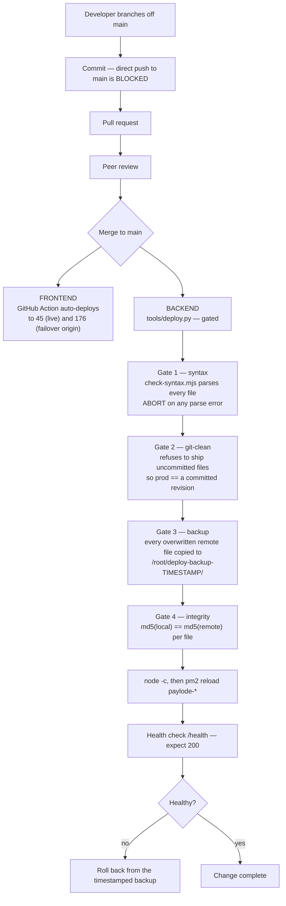

# ANNEX J — Secure SDLC and Change Management
### Paylode Services Limited · Alpha Morgan Bank AMB-ISO-VRQ-019 · CONFIDENTIAL

**Answers:** Domain 5 (5.1–5.8), items 7.6, 4.5
**Status:** the change-control pipeline is [VERIFIED] and genuinely strong for an
organisation of this size; the security-testing tooling is [GAP].

---

## J.1 The delivery pipeline as built

**Verified controls (`docs/DEPLOYMENT.md`, `.github/workflows/deploy.yml`, `CLAUDE.md`):**

- **Direct push to `main` is blocked** and every change reaches production through
  a reviewed pull request. **Verify before claiming:** confirm this is enforced by
  a **GitHub branch-protection rule** requiring a pull request and at least one
  approving review — not only by team convention. If the rule is not configured,
  configure it (it takes two minutes) before answering 5.5 "Yes".
- **Four independent pre-deploy gates**, any of which aborts the deploy.
- **The git-clean gate is a real segregation control** — it makes it impossible to
  ship a file that is not in version control, so production always corresponds to
  a reviewable commit. Few vendors of this size can say that.
- **Per-file cryptographic integrity verification** after upload (md5 comparison).
- **A rollback path exists for every deploy** — the previous version of each
  overwritten file is retained on the target host, timestamped.
- **Architecture verification tooling:** `npm run verify:arch` runs require
  resolution, route-parity, split-service, guard self-test and database-boundary
  checks — structural regression tests that keep the module boundaries intact.
- **Test suites:** Jest unit tests and a Playwright end-to-end suite.

---

## J.2 Domain 5 responses

| # | Question | Answer | Detail |
|---|---|---|---|
| 5.1 | Documented Secure SDLC aligned to OWASP Top 10 | **Partial** | The pipeline in J.1 is real and enforced, but it is documented as operational runbooks (`docs/DEPLOYMENT.md`, `CLAUDE.md`), not as an approved Secure SDLC policy mapped to OWASP. `policy/POL-05-change-management.md` §3 supplies the mapping and needs approval. |
| 5.2 | SAST in the CI/CD pipeline | **No** | Not deployed. **Free remediation available immediately:** enable **GitHub CodeQL** on the repository (native, no cost for this use, JavaScript supported) and add `semgrep --config=p/owasp-top-ten` as a PR check. GAP-28. |
| 5.3 | DAST before production releases | **No** | Not performed. Remediation: OWASP ZAP baseline scan against the staging URL as a scheduled workflow. GAP-28. |
| 5.4 | SCA for open-source vulnerabilities | **No** | Not deployed, though dependencies are lock-pinned. **Free remediation:** enable **Dependabot alerts and security updates**; add `npm audit --production` to the deploy gate. GAP-22. |
| 5.5 | Mandatory peer code review before production | **Yes**, subject to verification | Every change reaches production through a reviewed pull request. Confirm the GitHub branch-protection rule is actually configured (§J.1), then attach the settings screenshot and a sample of merged PRs as evidence. |
| 5.6 | Secrets only in an approved secrets manager, never hardcoded | **No — must be remediated first** | Application design is correct (all credentials read from `process.env`, `.env` git-ignored, `.env.example` carries placeholders only), **but live credentials are currently committed in `.claude/memory/project-paylode.md`**. See `ANNEX-E` §E.3 and GAP-05. Rotate, purge, add `gitleaks` and GitHub push protection, then answer "Yes" and attach the clean scan. |
| 5.7 | Key/secret lifecycle tracked — owner, rotation, decommission | **Partial** | The inventory exists in `ANNEX-E` §E.2 with named owners; rotation schedules are not yet enforced. `policy/POL-07` §4 sets them. |
| 5.8 | Formal change-approval workflow with segregation of duties | **Partial** | PR review plus the four deploy gates constitute a genuine change-approval workflow with an audit trail. **The limiting factor is team size** — with a small engineering team the author and the deployer may be the same person. Do not overclaim segregation that headcount does not support; state the compensating controls (mandatory PR review, git-clean gate, immutable deploy backups, `audit_logs` on every production configuration change) and the threshold above which a second approver is required per POL-05 §5. |

---

## J.3 Secure coding controls already in the codebase

Worth listing explicitly — several are stronger than the questionnaire assumes:

| Control | Implementation |
|---|---|
| SQL injection resistance | Prisma ORM with parameterised queries throughout; raw SQL uses `$queryRaw` tagged templates or `$queryRawUnsafe` **with positional parameters** (`$1::uuid`), never string concatenation of user input |
| Input validation | `express-validator` on request bodies |
| Security headers | `helmet` — CSP (`default-src 'self'`, `script-src 'self'`), HSTS one year with `includeSubDomains` |
| CORS | Explicit origin allow-list, not a wildcard; a fixed method and header allow-list |
| Body-size limits | 2 MB default; 50 MB only on the onboarding document endpoint; 5 MB per uploaded file |
| Rate limiting | Three tiers — see `ANNEX-B` §B.5 |
| Timing-attack resistance | `crypto.timingSafeEqual` for webhook signature comparison |
| Credential handling | API keys stored as SHA-256 hashes; passwords under bcrypt; `passwordHash` and `totpSecret` explicitly stripped from every API response |
| Authorisation | Role **and** permission checked server-side on every request, re-read from the database rather than trusted from the token |
| Monetary correctness | Integer kobo (`BigInt`) end to end; a custom JSON replacer serialises `BigInt` safely rather than losing precision |
| Error handling | Central error handler; no stack traces returned to clients |

---

## J.4 Infrastructure as code (7.6) and configuration baselines (4.5)

- **7.6 — Partial.** `docker-compose.yml`, the nginx configurations, the pm2
  `ecosystem.config.js` and the deploy tooling are all version-controlled and
  peer-reviewed through the same PR process — this covers the application
  topology. **Host provisioning is manual** (`scripts/deploy-full.sh` is a bootstrap
  script, not declarative IaC), so server state is not reproducible from code.
  Remediation: an Ansible playbook capturing host hardening, firewall rules,
  PostgreSQL configuration and backup scheduling. GAP-29.
- **4.5 — No.** No CIS Benchmark baseline is applied and no hardening compliance
  scan is run. Remediation: apply the CIS Ubuntu Linux Benchmark Level 1 to both
  hosts and evidence it with a `Lynis` or CIS-CAT scan. GAP-29.

---

## J.5 The two-hour improvement list

Everything below is free, requires no procurement, and converts questionnaire
answers from "No" to "Yes". Do these before returning the questionnaire — the
difference in how the response reads is disproportionate to the effort.

| Action | Converts |
|---|---|
| Enable GitHub **Dependabot** alerts + security updates | 5.4 → Yes |
| Enable GitHub **CodeQL** scanning | 5.2 → Yes |
| Enable GitHub **secret scanning + push protection** | 5.6 (with rotation) |
| Run **gitleaks** over the repository and history, attach the report | 5.6 evidence |
| Enable **DNSSEC** in the Cloudflare dashboard | 3.7 → Yes |
| Confirm the Cloudflare **WAF managed ruleset is in Block mode** | 3.2 → Yes |
| Publish **DMARC at `p=quarantine`** for the domain | 3.8 evidence |
| **Enforce TOTP** for all admin/compliance roles (small code change) | 2.1 → Yes |
| Add a nightly encrypted `pg_dump` to off-site storage and **test one restore** | 12.7 → Yes |
| Run an IR **tabletop** against the credential-exposure playbook, write it up | 11.4 → Yes |
