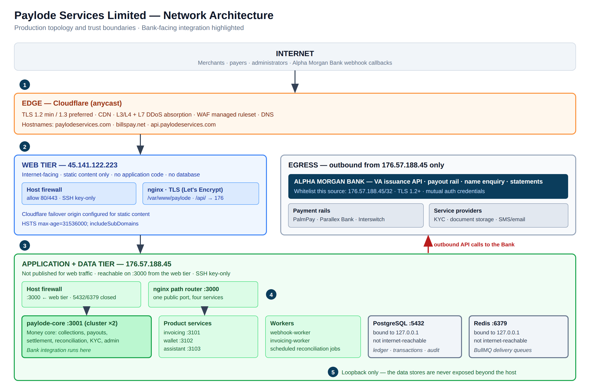
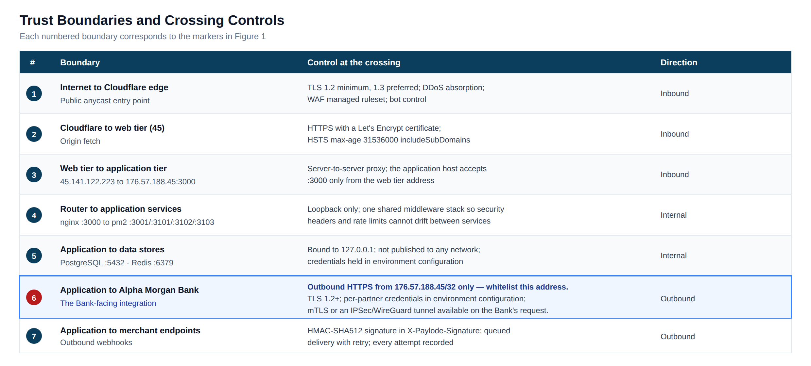

# Network Architecture Diagram

**Paylode Services Limited** · CBN-licensed Payment Solution Service Provider
Prepared for: **Alpha Morgan Bank — Information Security Division**
Assessment reference: **AMB-ISO-VRQ-019** · Classification: **CONFIDENTIAL**

| | |
|---|---|
| **Document ID** | PSL-EV-01 |
| **Version** | 1.0 |
| **Prepared by** | [                    ] |
| **Date** | [                    ] |
| **Addresses questionnaire items** | Section B (architecture diagram), 3.1, 3.2, 3.4, 3.5, 3.6, 6.2, 9.2, 12.3 |

---

## 1. Purpose

This document sets out the production network architecture of the Paylode payment
platform, the trust boundaries within it, and the specific network parameters
Alpha Morgan Bank requires in order to provision the integration — in particular
the fixed source IP address for the Bank's ingress allow-list.

## 2. Scope of the Bank integration

Alpha Morgan Bank is proposed as a provider of two services to Paylode:

- **Virtual account issuance** — dedicated, uniquely identifiable accounts issued to
  Paylode's customers for collections, settling into a designated Paylode
  collection account at the Bank.
- **A payout channel** — enabling Paylode to initiate disbursements to its customers
  through the Bank's payment infrastructure.

The integration is **API only**. Paylode does not require a direct database
connection, a file-transfer channel, an SDK or widget deployment, or access to any
Bank system beyond the two published APIs.

---

## 3. Production network architecture

### 3.1 Tier summary

| Tier | Host | Exposure | Runs |
|---|---|---|---|
| Edge | Cloudflare (anycast) | Public | TLS termination, CDN, DDoS absorption, WAF, DNS |
| Web | `45.141.122.223` | Internet-facing | nginx serving static content; reverse proxy of `/api/` to the application tier. **No application code. No database.** |
| Application + data | `176.57.188.45` | Not published for web traffic | nginx path router on `:3000`; four pm2 services; two workers; PostgreSQL; Redis |

### 3.2 Application tier composition

| Process | Port | Responsibility |
|---|---|---|
| `paylode-core` (pm2 cluster ×2) | 3001 | Money core — collections, payouts, settlement, reconciliation, KYC, administration. **The Bank integration runs here.** |
| `paylode-invoicing` | 3101 | Invoicing product |
| `paylode-wallet` | 3102 | Closed-loop member wallet product |
| `paylode-assistant` | 3103 | In-product support assistant |
| `webhook-worker` | — | Outbound signed webhook delivery with retry |
| `invoicing-worker` | — | Asynchronous invoicing jobs |
| PostgreSQL | 5432 | Transactional record, ledger, audit log — **bound to `127.0.0.1`** |
| Redis | 6379 | BullMQ delivery queues — **bound to `127.0.0.1`** |

A single nginx router presents one public port and path-routes to each service, so
the public URL surface is identical regardless of how the platform is decomposed
internally. All four services are built from one shared middleware factory, which
means security headers, CORS policy and rate limits **cannot drift between
services**.

### 3.3 Resilience properties relevant to the Bank

- A module that fails to load is reported at `/health/modules` and the platform
  continues in a **degraded** state rather than failing entirely.
- A product-service failure (invoicing, wallet, assistant) **cannot interrupt the
  money core**, because they are separate operating-system processes.
- Payout routing automatically excludes any rail not marked `LIVE`, so a single
  rail outage does not stop disbursement. Paylode therefore does not present a
  single-rail dependency risk to the Bank, and conversely a Bank-side outage does
  not queue Paylode indefinitely.

---

## 4. Trust boundaries

---

## 5. Fixed IP addresses for Bank whitelisting

This section answers questionnaire item **3.6** and constitutes the written
confirmation the item requests.

Paylode operates on **static, dedicated IPv4 addresses**. The infrastructure is not
autoscaled and does not sit behind a shared NAT pool, so these addresses are
stable.

| Address | Role | Relative to the Bank | Action required by the Bank |
|---|---|---|---|
| **`176.57.188.45/32`** | Paylode application host | **The only source of outbound API calls to Alpha Morgan Bank** — VA creation, name enquiry, payout instruction, balance and statement queries | **Add to the Bank's API ingress allow-list** |
| `45.141.122.223/32` | Paylode public web tier | Carries no Bank traffic | None — listed for completeness |

**Inbound to Paylode.** Bank webhook callbacks are delivered over TLS to a
published Paylode endpoint. Paylode will additionally restrict that endpoint to the
Bank's own source range once the Bank supplies it; please include it in the
integration pack.

**Change control.** Paylode will give Alpha Morgan Bank **not less than ten (10)
business days' written notice** before any change to the source address above. An
emergency change arising from host failure or disaster-recovery invocation will be
notified immediately to the Bank's nominated contact.

---

## 6. Transport security

| Path | Protection |
|---|---|
| Browser to edge | TLS 1.2 minimum, TLS 1.3 preferred |
| Edge to web tier | HTTPS with a Let's Encrypt certificate, renewed automatically on a 90-day cycle |
| HTTP Strict Transport Security | `max-age=31536000; includeSubDomains` — one year, applied to every API response |
| Content Security Policy | `default-src 'self'`; `script-src 'self'`; `img-src 'self' data:` |
| Cross-origin policy | Explicit origin allow-list with a fixed method and header set — not a wildcard |
| Paylode to the Bank and to all partners | Outbound HTTPS, TLS 1.2 or above |
| Paylode to merchant endpoints | HTTPS with an HMAC-SHA512 signature in the `X-Paylode-Signature` header |

**Independent verification.** The Bank is invited to run its own TLS assessment
against `api.paylodeservices.com`; Paylode will supply a current scan report on
request.

**Available on the Bank's requirement.** Paylode will terminate **mutual TLS** if
the Bank issues client certificates, and will terminate an **IPSec or WireGuard
tunnel** to the Bank in place of public-internet transport. Both are configuration
changes on the application host rather than architectural changes, and Paylode
offers them at no cost to the Bank.

---

## 7. Rate limiting and abuse control

Enforced in the shared middleware layer and keyed on the true client address (the
proxy chain is trusted to exactly one hop, so the forwarded client IP is used
rather than the proxy's).

| Scope | Window | Limit |
|---|---|---|
| All `/api/*` requests | 15 minutes | 100 requests |
| `/api/v1/auth/login` | 15 minutes | 10 attempts |
| `/api/v1/onboarding/submit` | 60 minutes | 10 submissions |
| Request body | per request | 2 MB (50 MB only on the onboarding document endpoint) |
| File upload | per file | 5 MB |

**A dedicated allowance will be configured for the Bank's callback source** so that
a legitimate settlement-day burst of collection notifications is never throttled.
Paylode proposes **600 requests per minute** on the Bank webhook path; please
confirm the Bank's expected peak notification rate so this can be set correctly
before go-live.

---

## 8. Site topology and disaster recovery

The primary site is the application host `176.57.188.45`. The web tier is
configured as a Cloudflare failover origin for static content.

Paylode's target architecture places a standby host in a **separate region from the
primary**, carrying a PostgreSQL streaming replica and a warm application stack,
with encrypted off-site backups held on infrastructure independent of both
production hosts. The recovery objectives associated with that architecture, and
the current position, are set out in document **PSL-EV-02 — Incident Response and
Business Continuity Policy**, section 8.

---

## 9. Document control

| Field | Value |
|---|---|
| Prepared by | [                                        ] |
| Reviewed by | [                                        ] |
| Approved by | [                                        ] |
| Date of issue | [                    ] |
| Next review | [                    ] |
