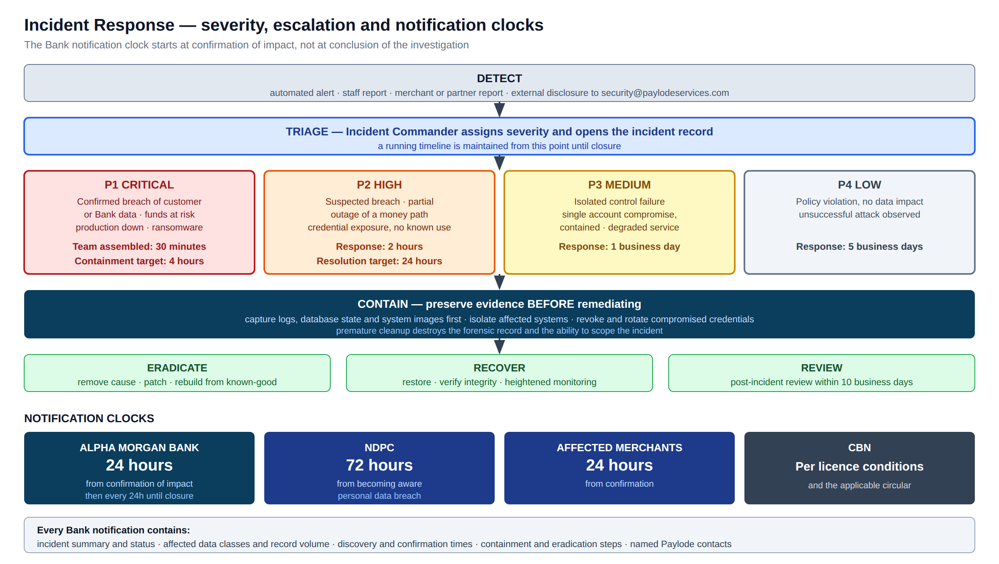

# Incident Response and Business Continuity Policy

**Paylode Services Limited** · CBN-licensed Payment Solution Service Provider
Prepared for: **Alpha Morgan Bank — Information Security Division**
Assessment reference: **AMB-ISO-VRQ-019** · Classification: **CONFIDENTIAL**

| | |
|---|---|
| **Document ID** | PSL-EV-02 |
| **Version** | 1.0 |
| **Policy owner** | [                    ] |
| **Approved by** | [                    ], Director |
| **Date of approval** | [                    ] |
| **Review cycle** | Annually, or on material change |
| **Addresses questionnaire items** | 11.1–11.6, 12.1–12.7, 10.5, 10.6 |

---

## PART A — INCIDENT RESPONSE

## 1. Scope

Any event that compromises, or credibly threatens, the confidentiality, integrity
or availability of Paylode systems or data — including data processed on behalf of
Alpha Morgan Bank, its customers, or Paylode's merchants.

## 2. Guiding principle

**No response action may create a risk of double-payment or lost funds.** A delayed
payment is recoverable; a duplicated one may not be. Where a containment action and
a settlement action conflict, containment proceeds and settlement is suspended
until reconciliation is complete.

## 3. Severity, escalation and notification

## 4. Response team

| Role | Responsibility | Holder |
|---|---|---|
| **Incident Commander** | Owns the incident; declares severity; authorises containment; single decision-maker | [                    ] |
| Technical lead | Investigation, containment, eradication, recovery | [                    ] |
| Compliance / Data Protection Officer | Regulatory notification to CBN and NDPC; record-keeping | [                    ] |
| Communications | Bank, merchant and customer notification | [                    ] |
| Executive sponsor | Director-level decisions: service suspension, external counsel, law enforcement | [                    ] |

### 4.1 Incident contact card — to be shared with the Bank

| Role | Name | Title | Mobile (24/7) | Email |
|---|---|---|---|---|
| Primary security incident contact | [              ] | [              ] | [              ] | security@paylodeservices.com |
| Secondary / escalation | [              ] | [              ] | [              ] | [                    ] |
| Executive escalation | [              ] | Director | [              ] | [                    ] |
| Data protection contact | [              ] | DPO | [              ] | dpo@paylodeservices.com |

*The `security@` and `dpo@` mailboxes must be live and monitored before this card is
issued to the Bank.*

## 5. Response lifecycle

1. **Detect** — automated alert, staff report, merchant or partner report, or
   external disclosure.
2. **Triage** — the Incident Commander assigns severity within the band's response
   window and opens the incident record. A running timeline is maintained from this
   point until closure.
3. **Contain** — isolate affected systems; revoke or rotate compromised credentials;
   suspend affected merchant accounts, rails or API keys. **Preserve evidence
   before remediating** — capture logs, database state and system images first.
   Premature cleanup destroys the forensic record and the ability to scope the
   incident.
4. **Eradicate** — remove the cause; patch; rebuild from a known-good state.
5. **Recover** — restore service; verify integrity; monitor at heightened
   sensitivity for a defined period.
6. **Notify** — per section 6.
7. **Review** — post-incident review within **10 business days** (Appendix A).

## 6. Notification obligations

| Recipient | Trigger | Deadline |
|---|---|---|
| **Alpha Morgan Bank** | Confirmed impact to Bank data or the Bank-connected service | **24 hours from confirmation**, then every 24 hours until closure |
| Nigeria Data Protection Commission | Personal data breach | 72 hours from becoming aware |
| Central Bank of Nigeria | Per licence conditions and the applicable cybersecurity circular | As prescribed |
| Affected data subjects | High risk to their rights and freedoms | Without undue delay |
| Affected merchants | Their data or funds affected | 24 hours from confirmation |

Every notification to the Bank contains, at minimum:

- incident summary and current status;
- affected data classes and estimated record volume;
- time of discovery and time of confirmation;
- containment and eradication steps taken and planned;
- named Paylode points of contact for the Bank's incident team.

Paylode notifies the Bank **regardless of whether the regulator's 72-hour threshold
is met**. The Bank's contractual clock is shorter than the regulator's, and it runs
from confirmation of impact rather than from conclusion of the investigation.

## 7. Playbooks

### 7.1 Credential exposure
1. Identify every credential exposed and its blast radius.
2. **Rotate all of them immediately** — do not assess likelihood of use first.
3. Review access logs across the exposure window for use by an unrecognised source.
4. Purge from the exposure vector (repository history, log, message, document).
5. If evidence of use exists, escalate to P1 and treat as a breach.
6. Add the detective control that would have caught it.

### 7.2 Data breach
1. Contain — revoke access, isolate the system, preserve evidence.
2. Scope — what data, whose, how many records, over what window.
3. Notify per section 6. The Bank clock starts at confirmation.
4. Support affected parties; remediate the root cause.

### 7.3 Ransomware
1. Isolate affected hosts from the network immediately.
2. **Do not pay.** Engage the executive sponsor and external counsel.
3. Restore from verified clean off-site backup (Part B, section 9).
4. Rebuild rather than clean; rotate every credential the host could reach.
5. Report to the CBN and to law enforcement.

### 7.4 Insider threat
1. Preserve the audit trail before acting — the audit log holds actor, before and
   after state, and source IP for every privileged action.
2. Suspend access without notice to the subject.
3. Engage HR, the executive sponsor and legal counsel before any confrontation.
4. Assess exfiltration; notify per section 6 if confirmed.

### 7.5 Payment rail or Bank integration compromise
1. Disable the affected rail. Routing excludes it automatically and disbursement
   continues on other rails.
2. **Reconcile every in-flight instruction before resuming.** Never re-send an
   instruction whose outcome is unknown — re-query it.
3. Notify the Bank or rail partner and agree a joint reconciliation.
4. Resume only once end-to-end reconciliation balances.

### 7.6 Production outage
1. Confirm through the health endpoints.
2. Identify the failing component; a failed module degrades rather than kills the
   platform.
3. Roll back from the timestamped deploy backup if a deployment is implicated.
4. Invoke Part B if recovery will exceed the recovery time objective.

## 8. Detection and response targets

| Metric | Target |
|---|---|
| Mean time to detect — payment or settlement anomaly | **5 minutes** (met today by the payout watchdogs) |
| Mean time to detect — critical security event | 1 hour |
| Mean time to respond — P1 containment | 4 hours |
| Mean time to respond — P2 | 24 hours |
| Bank notification after confirmation | 24 hours |
| Scoped log extract to the Bank on request | **4 business hours**; **1 business hour** during a live incident |

## 9. Exercising

A tabletop exercise or live simulation is conducted **at least annually** against at
least one playbook, producing a written after-action report that identifies what
worked, what did not, and dated remedial actions with named owners.

| Exercise | Date | Playbook | After-action report |
|---|---|---|---|
| [                    ] | [              ] | [                    ] | [                    ] |

---

## PART B — BUSINESS CONTINUITY AND DISASTER RECOVERY

## 10. Objective

To maintain, or restore within agreed time limits, the services Paylode provides to
its merchants and to its bank partners, with priority on **money-movement
integrity** over speed of restoration.

## 11. Business impact analysis

| Service | Criticality | Maximum tolerable outage | Impact of outage |
|---|---|---|---|
| Payout dispatch | **Critical** | 4 hours | Merchants cannot disburse; beneficiaries unpaid |
| Collection webhook ingestion | **Critical** | **1 hour** | Credits unrecorded; reconciliation exposure grows with the outage |
| Settlement processing | **Critical** | 24 hours | Merchants unfunded; cycle slips |
| Hosted checkout | High | 4 hours | Merchants cannot collect card payments |
| Merchant dashboard | Medium | 24 hours | No self-service; operations can act on merchants' behalf |
| Invoicing / wallet / assistant | Medium | 24 hours | Product features degraded; **payments unaffected** |
| Marketing site | Low | 72 hours | Reputational only |

Collection webhook ingestion carries the shortest tolerance because a missed
notification is not merely a delay — it is an **unrecorded credit** that must later
be reconciled against the Bank's records.

## 12. Continuity capability

| Capability | Mechanism |
|---|---|
| Process redundancy | The money core runs as a clustered pair with automatic restart |
| Service isolation | A product-service failure cannot stop payments |
| Graceful degradation | A failed module is reported at the health endpoint; the platform continues |
| **Multi-rail failover** | Payout routing automatically excludes any rail not marked live — **a single rail outage, including the Bank's, does not stop disbursement** |
| Deploy rollback | Every deployment retains the previous version of each overwritten file, timestamped, on the target host |
| Self-healing money paths | Dispatch recovery every 30 seconds; stuck-batch monitor and status re-query every 5 minutes |
| Static-content failover | The application host is configured as a Cloudflare failover origin and is refreshed on every release |

## 13. Recovery objectives

| Scenario | Objective |
|---|---|
| Single process crash | Seconds — automatic restart, cluster peer serves |
| Product-service failure | No payment impact |
| One payment rail unavailable | Immediate automatic re-route |
| Web tier host loss | Minutes — failover origin serves static content; the API is unaffected |
| **Application host loss** | **RTO ≤ 4 hours · RPO ≤ 15 minutes** |
| **Data corruption or ransomware** | **RPO ≤ 24 hours** from encrypted off-site backup |
| Region or provider loss | RTO ≤ 24 hours |

*The objectives for application-host loss and data corruption depend on the standby
and backup capability described in sections 14 and 15. Current attainment against
each objective is to be recorded by Paylode below.*

| Objective | Current attainment | Evidence |
|---|---|---|
| Application host loss — RTO 4h / RPO 15min | [                    ] | [                    ] |
| Data corruption — RPO 24h | [                    ] | [                    ] |

## 14. Target site topology

The standby host sits in a **separate region from the primary**, carrying a
PostgreSQL streaming replica and a warm application stack. Replication traverses an
encrypted tunnel. Encrypted off-site backups are held on infrastructure independent
of both production hosts.

## 15. Backup standard

| Property | Requirement |
|---|---|
| Scope | Full PostgreSQL dump; application, nginx and process-manager configuration; key custody records |
| Frequency | **Nightly full**, plus continuous write-ahead-log archiving once replication is in place |
| Encryption | Encrypted at rest, with the key held separately from the backup store |
| Location | **Off-site**, independent of both production hosts |
| Retention | 30 daily, 12 weekly, 12 monthly |
| Access | Restricted to two named individuals; access logged |
| Immutability | Write-once or object-lock storage, so ransomware cannot reach the backups |
| **Restore testing** | **Quarterly**, to an isolated environment, with row counts and ledger integrity verified and the result recorded |

**An untested backup is not a backup.** The quarterly restore test, not the
existence of a dump file, is the control.

| Restore test | Date | Performed by | Result |
|---|---|---|---|
| [                    ] | [              ] | [                    ] | [                    ] |

## 16. Disaster recovery procedure

1. **Declare** — the Incident Commander or a director declares a disaster and
   notifies the response team and affected bank partners.
2. **Assess** — determine scope and whether data integrity is affected.
3. **Recover** — promote the standby, or rebuild and restore the most recent
   verified backup.
4. **Reconcile before resuming money movement.** This step is mandatory and is
   never skipped for speed. Reconcile every in-flight payout and collection against
   the rail's and the Bank's records. **Re-query, never re-send.**
5. **Resume** — restore service under heightened monitoring.
6. **Notify** — inform merchants and bank partners of restoration and of any
   transaction requiring their action.
7. **Review** — post-incident review within 10 business days.

## 17. Testing schedule

| Test | Cadence | Last performed |
|---|---|---|
| Backup restore verification | Quarterly | [                    ] |
| Failover to standby | Annually | [                    ] |
| Full DR simulation with the response team | Annually | [                    ] |
| Rail failover verification | Semi-annually | [                    ] |

## 18. Capacity and demand management

Paylode forecasts payout float requirements daily from actual destination-bank
demand over a rolling history window, and pre-funds each rail accordingly. Per-rail
transactions-per-second limits and daily value caps prevent partner overload. Rail
float is polled continuously with low-balance alerting.

Documented headroom thresholds for compute, memory, disk and database connections,
and load testing against the projected peak, are maintained by the technical lead.

## 19. Service level commitment

| Term | Commitment |
|---|---|
| Monthly uptime, Bank-facing collection and payout APIs | [          ] % |
| Measurement | Health probes at 1-minute intervals from an independent monitor, excluding scheduled maintenance |
| Scheduled maintenance | Notified 5 business days in advance; performed 00:00–04:00 WAT; capped at 4 hours per month |
| Service credits | [                                                            ] |
| Reporting | Monthly availability report to the Bank |

## 20. Crisis communication

| Audience | Channel | Owner | Timing |
|---|---|---|---|
| Bank partners | Direct to the named contact | Incident Commander | **Within 1 hour of declaration** |
| Merchants | Email and dashboard banner | Operations | Within 2 hours |
| Staff | Internal channel | Incident Commander | Immediately |
| CBN | Per licence conditions | Compliance | As prescribed |
| Public | Status page | Communications | As material |

---

## Appendix A — Post-incident review template

Incident identifier · severity · detection time · containment time · resolution
time · timeline of events · root cause analysis · data and funds impacted · parties
notified and when · what worked · what did not · remedial actions with owners and
dates · lessons recorded in the risk register.

---

## Document control

| Field | Value |
|---|---|
| Prepared by | [                                        ] |
| Reviewed by | [                                        ] |
| Approved by | [                                        ] |
| Signature | [                                        ] |
| Date of issue | [                    ] |
| Next review | [                    ] |
