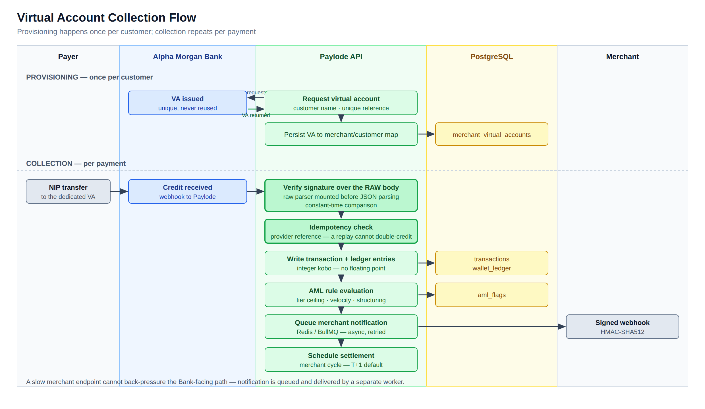
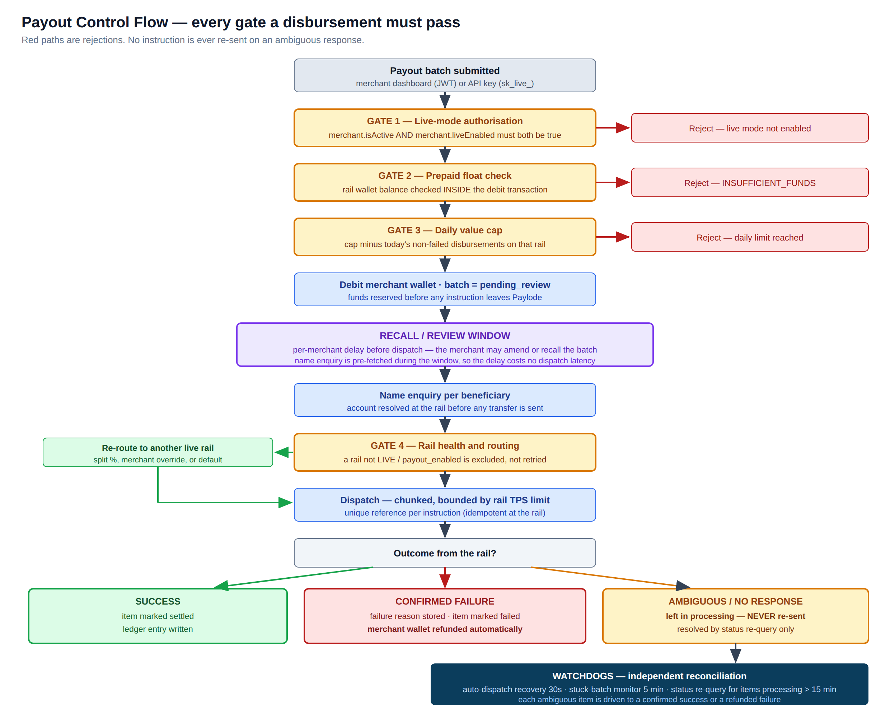

# Virtual Account and Payout Security Controls

**Paylode Services Limited** · CBN-licensed Payment Solution Service Provider
Prepared for: **Alpha Morgan Bank — Information Security Division**
Assessment reference: **AMB-ISO-VRQ-019** · Classification: **CONFIDENTIAL**

| | |
|---|---|
| **Document ID** | PSL-EV-03 |
| **Version** | 1.0 |
| **Prepared by** | [                    ] |
| **Date** | [                    ] |
| **Addresses questionnaire items** | Domain 16 in full (16.1–16.10), 6.5, 6.9, 13.9 |

---

## 1. Purpose

This document describes the controls Paylode applies to the two services it
proposes to consume from Alpha Morgan Bank: **virtual-account collections** and the
**payout channel**. It is the operational heart of the Bank's exposure to Paylode,
and every control described here is implemented in the production platform.

---

## 2. Control summary

| Control | Position |
|---|---|
| Unique virtual account per customer, no reuse of numbers | Implemented |
| Customer funds segregated from Paylode operating funds | Implemented |
| Committed settlement cycle | **T+1 default**, T+0 available by arrangement |
| Payouts are **prepaid** — no credit exposure to the Bank | Implemented |
| Per-rail daily value cap and transactions-per-second ceiling | Implemented |
| Tiered per-transaction ceilings with AML flagging | Implemented |
| Name enquiry before every transfer | Implemented |
| Recall / review window before dispatch | Implemented |
| Automatic refund to the merchant on confirmed failure | Implemented |
| **No instruction is ever re-sent on an ambiguous response** | Implemented |
| Two independent payout watchdogs | Implemented |
| Daily reconciliation against Bank records | Implemented |
| Full audit trail with before-and-after state | Implemented |

---

## 3. Virtual account collections

### 3.1 Collection flow

### 3.2 Account allocation (item 16.1)

Virtual accounts are provisioned **one per customer** through the Bank's issuance
API and persisted in a mapping table keyed to the merchant and the customer
reference. Account numbers are issued by the sponsoring institution and are **never
recycled across customers** by Paylode.

Provisioning is administratively gated. A virtual account is not issued until the
merchant's KYC submission carries **approved corporate registration data**, so an
unverified merchant cannot obtain collection infrastructure.

The numbering scheme is to be agreed with the Bank. Paylode's only requirements are
that each account is unique, permanently mapped to one customer of one merchant,
and carries a Paylode-supplied reference at creation so that inbound credits are
attributable without ambiguity.

### 3.3 Integrity of inbound notifications

Three controls protect every credit notification the Bank sends:

1. **Signature verified over the raw request body.** The raw-body parser is mounted
   ahead of JSON parsing, so the signature is checked against the exact bytes
   received. This defeats the canonicalisation attacks that defeat naive
   re-serialisation approaches.
2. **Constant-time comparison.** The signature check uses a timing-safe comparison
   rather than string equality, so it cannot be attacked by timing analysis.
3. **Idempotency on the provider reference.** A replayed or duplicated notification
   cannot create a second ledger entry or double-credit a merchant.

Monetary values are held throughout as **integer kobo**, never as floating-point
numbers, so no rounding drift can accumulate across the ledger.

### 3.4 Fund segregation (item 16.2)

Collected customer funds settle into a designated collection account and are
tracked in the platform ledger as **liabilities to merchants**, distinct from
Paylode revenue. Fees and VAT are computed per transaction and settled separately
from the merchant's principal.

*Supporting evidence to attach: the Bank mandate or account-opening confirmation
showing the collection account is designated as a customer-funds / pooled
collection account rather than a Paylode operating account.*

### 3.5 Settlement cycle (item 16.3)

The default merchant settlement cycle is **T+1**. Settlement batches are generated
and fired by a continuously running scheduled job, with a daily generation cycle
anchored at **00:01 Africa/Lagos**, implemented on a self-correcting schedule so
that no timezone or drift error can displace it.

**T+0 settlement** can be supported for named merchants where the Bank's liquidity
arrangement permits. The cycle and any cut-off time to be supported should be
recorded in the integration agreement.

---

## 4. Payout controls

### 4.1 Payout control flow

### 4.2 The prepaid model — the Bank's primary protection

A merchant may only disburse funds **already funded into a per-rail wallet**. There
is no credit line and no overdraft facility. The float check runs **inside the same
database transaction as the debit**, so a concurrent-request race cannot overdraw
the wallet.

The practical consequence for Alpha Morgan Bank is that **Paylode presents no
settlement credit exposure on the payout channel** — funds are reserved on the
Paylode side before any instruction reaches the Bank.

### 4.3 Limits and velocity control (item 16.5)

Limits are enforced at four independent layers:

| Layer | Control |
|---|---|
| Rail | Daily value cap — remaining capacity computed as the cap less the day's non-failed disbursements, evaluated inside the dispatch transaction |
| Rail | Transactions-per-second ceiling — dispatch concurrency is bounded per rail |
| Merchant | Prepaid wallet balance is an absolute ceiling |
| Merchant / KYC tier | Per-transaction ceilings by tier: **Tier 1 ₦5,000,000 · Tier 2 ₦100,000,000 · Tier 3 ₦500,000,000**. A transaction above 80% of the tier ceiling raises a HIGH-severity AML flag for compliance disposition. |

Rail caps are adjustable only by a super-administrator, and every change is
audit-logged with the actor, the previous value, the new value and the source IP.

**Commitment to the Bank:** Paylode will configure the Bank-agreed per-transaction
and daily aggregate ceilings on the Alpha Morgan rail before go-live, and **will not
raise them without the Bank's written agreement**.

### 4.4 Authorisation and review controls (item 16.4)

| Control | Effect |
|---|---|
| Live-mode gate | A live API key is inert until an administrator has explicitly enabled live mode on the merchant. Account activation alone grants portal and sandbox access only — it does **not** enable real money movement, for collections or payouts. |
| Recall / review window | A batch is created in `pending_review` and dispatch is deferred by a per-merchant window, during which the merchant may amend or recall it. Name enquiry is pre-fetched during the window, so the delay costs no dispatch latency. |
| Administrative segregation | Wallet funding, rail rebalancing, routing changes and cap changes require a super-administrator. Merchants cannot fund their own wallet or alter their own limits. |
| Settlement-account change control | A merchant's request to change their settlement destination is held in a pending state until an administrator approves it. A merchant **cannot unilaterally redirect their own settlement**. |
| Audit | Every administrative and money-movement action writes an audit record with actor, action, entity, **full before and after state**, free-text rationale and source IP. |

### 4.5 Beneficiary validation and screening (item 16.6)

Every beneficiary is **name-enquiry validated at the rail before any transfer is
sent**, so funds are never dispatched to an unresolvable account.

Transaction surveillance runs against every transaction through a rule engine that
raises dispositionable flags:

| Rule | Severity |
|---|---|
| Single transaction above 80% of the merchant's KYC tier ceiling | HIGH |
| More than 20 transactions from one merchant within 2 hours | CRITICAL |
| Five or more round-number transactions in a day (structuring indicator) | MEDIUM |

Flags are worked by the compliance role through a dedicated review surface, with a
compliance watchlist and an exception workflow supporting defer, clear and block
dispositions. Deferred items are automatically re-opened on expiry by an hourly
sweep, so a deferral cannot silently become a permanent exemption.

*Sanctions and politically-exposed-person screening against a licensed list is being
integrated into the pre-dispatch path; the provider selection and delivery date are
recorded separately.*

### 4.6 Failure, reversal and delay handling (item 16.8)

| Outcome | Handling |
|---|---|
| **Confirmed success** | Item marked settled; ledger entry written |
| **Confirmed failure** | Failure reason stored; item marked failed; **the merchant wallet is refunded automatically**, timestamped and attributed, without requiring a support ticket |
| **Ambiguous or absent response** | The item remains in `processing` and **is never re-sent**. It is resolved only by status re-query. |

This last control is the single most important protection against double-payment,
and it is deliberate: a delayed payment is recoverable, a duplicated one may not be.

Batch-level retry is available for failed items only. Batch reports are exportable
as PDF and CSV for merchant and Bank reconciliation.

---

## 5. Reconciliation (item 16.7)

Four independent layers reconcile Paylode's ledger against rail and Bank records:

| Layer | Frequency | Function |
|---|---|---|
| Continuous payout reconciliation | Short interval, continuous | Re-queries the rail for the true status of sent items |
| Stuck-batch monitor | **Every 5 minutes** | Finds batches in `processing` whose legs were never sent; recovers or alerts |
| Payout watchdog | **Every 5 minutes** | Items in `processing` for more than **15 minutes** are re-queried at the rail and resolved to success, or failed with automatic refund |
| Rail float synchronisation | Periodic | Compares each rail's balance against the platform's expected float, with low-balance alerting |
| Bank statement reconciliation | On upload / daily | Matches statement credit lines to settlements 1:1, on amount within a configurable tolerance **and** a date window covering the expected T+1/T+2 landing lag, classifying each line as matched, partial or unmatched |

**Discrepancy-resolution service levels offered to the Bank:**

| Stage | Commitment |
|---|---|
| Unmatched item raised | Within **1 business day** of the reconciliation run |
| Investigation commenced | Immediately on identification |
| Resolution or written status to the Bank | Within **3 business days** |
| Value-affecting discrepancy | Escalated to the incident contact **on discovery**, outside the SLA clock |

---

## 6. Status reporting to the Bank (item 16.9)

Paylode operates signed webhook infrastructure in both directions, with
HMAC-SHA512 signatures, raw-body verification, asynchronous delivery through a
queue with retry, and a delivery audit table recording every attempt.

Paylode will publish a Bank-facing status callback for collections and payouts on
whatever schema the Bank specifies, or consume the Bank's callbacks — whichever the
Bank's integration pack defines. Polling endpoints for item and batch status are
available as a fallback.

---

## 7. Volume and value projections (item 16.10)

To be completed by Paylode from platform history. The Bank will size its own
limits, float and monitoring from these figures.

| Field | Value |
|---|---|
| Maximum single collection value | ₦ [                    ] |
| Maximum single payout value | ₦ [                    ] |
| Expected daily collection volume / value | [          ] transactions / ₦ [                    ] |
| Expected daily payout volume / value | [          ] transactions / ₦ [                    ] |
| Expected monthly value through the Bank | ₦ [                    ] |
| Peak-day multiple (month-end, salary runs) | [          ] × average |

---

## 8. Document control

| Field | Value |
|---|---|
| Prepared by | [                                        ] |
| Reviewed by | [                                        ] |
| Approved by | [                                        ] |
| Date of issue | [                    ] |
| Next review | [                    ] |
